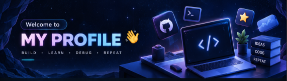

<h1 align="center">Hi 👋, I'm Sarthak Suman Mishra</h1>

<h3 align="center">Computer Science Undergraduate • Full Stack Developer • AI/ML & IoT Enthusiast</h3>

  

## 👨‍💻 About Me

Computer Science undergraduate at KIIT University with hands-on experience building web applications, AI/ML solutions, and IoT systems.

🔭 I’m currently working on personal projects and full-stack applications

🌱 I’m currently learning RAG, AI/ML and modern application development

💡 I’m interested in Full Stack Development, AI/ML, IoT and Cloud

🤝 I’m open to collaborating on hackathons and impactful technical projects

🧩 I enjoy debugging, building and turning ideas into working systems

🏆 1st Place – Project Expo on Cyber Physics & Industrial IoT

📜 Patent Holder – AI-Powered Multicurrency Crypto Wallet

📫 Reach me at sarthakmshr12@gmail.com

## 🛠️ Tech Stack

Languages

  
  
  
  
  

Web & Backend

  
  
  
  
  

AI / Machine Learning

  
  
  
  

Cloud, Database & Tools

  
  
  
  
  
  

IoT & Embedded

  
  

## 🏆 Achievements

🥇 1st Place – Project Expo on Cyber Physics & Industrial IoT

📜 Patent Holder – AI-Powered Multicurrency Crypto Wallet

🚀 Participated in Smart India Hackathon

## 🤝 Connect With Me

  
  &nbsp;&nbsp;&nbsp;
  
  &nbsp;&nbsp;&nbsp;
  
  &nbsp;&nbsp;&nbsp;
  

## 📊 GitHub Statistics

  

  

